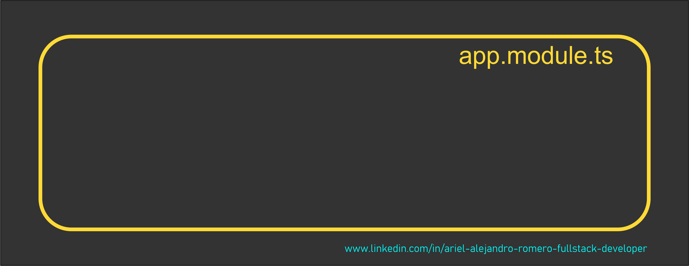
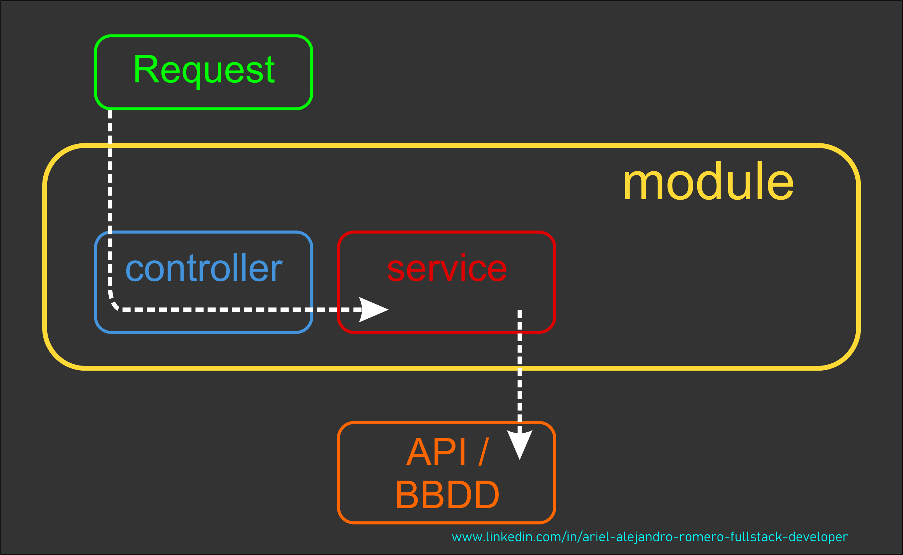
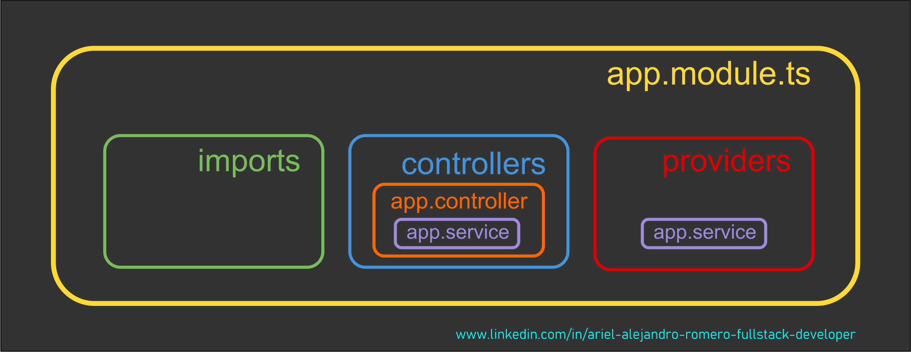
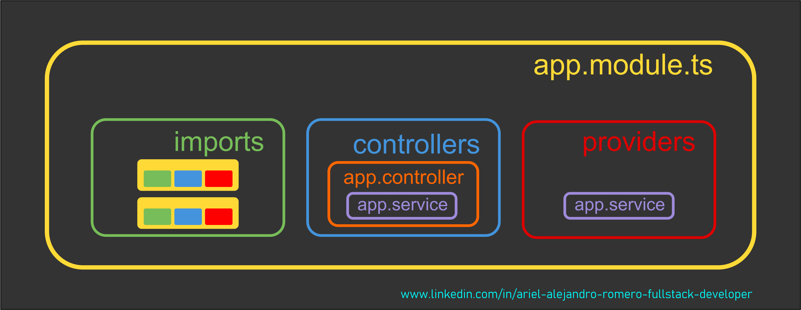
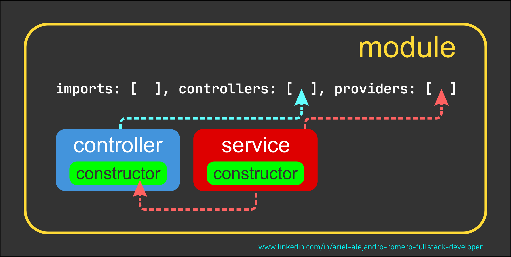

# Nest JS - Fundamentals I

[Volver a Inicio](../README.md)

## Módulos

## Inyección de Dependencias

## Request, Módulos, Controladores y Servicios

## Módulos, Controladores y Servicios

### 🎯Resumen

- Los MÓDULOS son CLASES definidas mediante el decorador @Module que actúan como unidades organizativas dentro de la aplicación.
  - Utilizan Servicios, Controllers e incluso otros Módulos creando una unidad independiente y autónoma.
- Los SERVICIOS son los responsables de la lógica de negocios y las operaciones de datos (MÉTODOS), con el propósito de que puedan ser reutilizados por diversos controladores.
  - Son usados por los CONTROLADORES
    Debemos declararlos en los MÓDULOS
- Los CONTROLLERS son clases que reciben las solicitudes entrantes
  - Manejan una ruta específica, evalúan el método HTTP.
  - Desestructuran la Información Recibida
  - Invocan al SERVICIO correspondiente
  - Devuelven la respuesta al cliente.
  - Debemos declararlos en los Módulos.

## Scaffolding

### Enfoque Modular

- Organiza el proyecto en carpetas que representan roles o componentes claves.
- Las carpetas contienen archivos que se centran en una función específica.
  src/

  |-- controllers

  |-- modules

  |-- services

### Enfoque Funcional (el recomendado en Nest JS)

- Organiza tu proyecto en carpetas que representan características específicas del proyecto.
  src/

  |-- todos

  |-- users

## Sobre LF y CRLF

> LF (Line Feed) y CRLF (Carriage Return + Line Feed) son secuencias de control utilizadas en sistemas informáticos para representar el final de una línea de texto.

### LF (Line Feed)

Es un carácter de control que se utiliza para indicar el final de una línea de texto en sistemas Unix y Unix-like (como Linux y macOS). En ASCII, el código de LF es 10 (0x0A en hexadecimal). Cuando se encuentra un LF, el cursor de escritura se mueve a la siguiente línea.

### CRLF (Carriage Return + Line Feed)

Es una combinación de dos caracteres de control que se utiliza para indicar el final de una línea de texto en sistemas Windows y DOS. El Carriage Return (retorno de carro) es un carácter que mueve el cursor al principio de la línea, y el Line Feed es el carácter que indica el final de la línea. En ASCII, el código de Carriage Return es 13 (0x0D) y el código de Line Feed es 10 (0x0A).

### En resumen

LF se utiliza en sistemas Unix para indicar el final de una línea de texto, mientras que CRLF se utiliza en sistemas Windows y DOS para el mismo propósito. Estas diferencias en el manejo de los saltos de línea a veces pueden causar problemas de compatibilidad al trabajar con archivos de texto en diferentes sistemas operativos.
