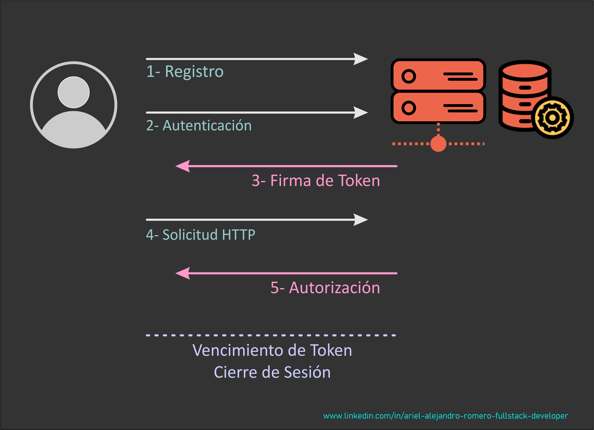

# Nest JS - Nest JS Authentication II

[Volver a Inicio](../README.md)

## Autenticación y Autorización

> La autenticación y la autorización son dos conceptos fundamentales en la seguridad informática, pero tienen funciones distintas.

### Autenticación (Authentication):

- Definición: Es el proceso de verificar la identidad de un usuario o sistema.
- Objetivo: Asegurarse de que la persona o sistema es quien dice ser.
- Métodos Comunes: Uso de contraseñas, tarjetas de identificación, biometría (huellas dactilares, reconocimiento facial), tokens de seguridad, etc.
- Ejemplo: Ingresar a un sistema con un nombre de usuario y una contraseña. Aquí, el sistema verifica que la combinación de credenciales es válida.

### Autorización (Authorization):

- Definición: Es el proceso de verificar si un usuario o sistema autenticado tiene permiso para acceder a un recurso o realizar una acción específica.
- Objetivo: Asegurarse de que el usuario o sistema tiene los derechos necesarios para acceder a los recursos o realizar las operaciones solicitadas.
- Métodos Comunes: Listas de control de acceso (ACLs), roles y permisos, políticas de acceso basadas en atributos.
- Ejemplo: Un usuario que se ha autenticado en un sistema intenta acceder a un archivo. El sistema verifica si ese usuario tiene los permisos necesarios para leer, escribir o modificar ese archivo.

### Diferencias Clave:

- Orden de Ejecución: La autenticación siempre se realiza antes de la autorización. Primero se verifica la identidad, y luego se determina si esa identidad tiene los permisos adecuados.
- Función: La autenticación se centra en confirmar "quién eres", mientras que la autorización se centra en determinar "qué puedes hacer".
- Resultado: La autenticación da como resultado la confirmación de la identidad del usuario. La autorización da como resultado la concesión o denegación de acceso a recursos específicos basados en permisos.
- Ambos procesos son cruciales para la seguridad de los sistemas, ya que ayudan a proteger contra el acceso no autorizado y el uso indebido de recursos.
