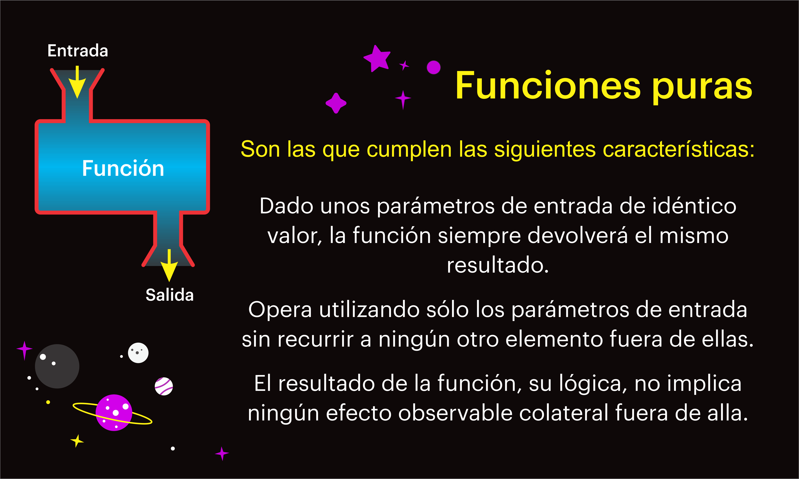

# Nest JS - JavaScript III

[Volver a inicio](../README.md)

## 🎉 REGALOS DE FIN DE BOOTCAMP - ¡¡¡FELICIDADES EQUIPO!!! 🎉

- [FODA: Fortalezas/Oportunidades Debilidades/Amenazas](FODA.md)
- [Código Limpio en JavaScript](https://github.com/andersontr15/clean-code-javascript-es)
- [Toda la Documentación en un solo lugar](https://devdocs.io/)
- [El gran libro de HTML5, CSS3 y JavaScript](https://github.com/jorgegarba/CodiGo8/blob/master/El%20gran%20libro%20de%20HTML5%2C%20CSS3%20y%20JavaScript%20Ed%203.pdf)
- Libros en Inglés sobre nuestro lenguaje favorito:
  - [Eloquent JavaScript](https://eloquentjavascript.net/)
  - [You Dont Know JS](https://github.com/getify/You-Dont-Know-JS)
- Algunas páginas donde poder practicar:
  1. [freeCodeCamp](https://www.freecodecamp.org/): Ofrece un currículum completo de desarrollo web con muchos desafíos de JavaScript interactivos.
  2. [Codewars](https://www.codewars.com/): Te permite resolver desafíos de programación en diferentes niveles de dificultad, lo que te ayudará a mejorar tus habilidades de JavaScript.
  3. [HackerRank](https://www.hackerrank.com/): Tiene una serie de desafíos y tutoriales específicos de JavaScript para que puedas practicar y mejorar.
  4. [LeetCode](https://leetcode.com/): Ofrece problemas de codificación que puedes resolver en JavaScript y en otros lenguajes de programación.
  5. [Exercism](https://exercism.org/): Ofrece ejercicios de programación y revisiones de mentores para ayudarte a aprender y mejorar tus habilidades de JavaScript.
  6. [JSFiddle](https://jsfiddle.net/): Es una herramienta en línea donde puedes escribir, ejecutar y compartir código JavaScript.
  7. [Codecademy](https://www.codecademy.com/): Ofrece un curso interactivo de JavaScript donde puedes aprender y practicar al mismo tiempo.
  8. [Edabit](https://edabit.com/): Proporciona una gran cantidad de desafíos de codificación en JavaScript y otros lenguajes.
  9. [Ejercicios de JavaScript para Navidad 🎄](https://adventjs.dev/es): Un ejercicio de JavaScript para cada día de Diciembre.

## FUNCIONES PURAS



## ERRORES Y EXCEPCIONES

> En el contexto de la programación, los términos "error" y "excepción" a menudo se usan indistintamente, pero técnicamente tienen diferencias sutiles, especialmente en lenguajes con manejo de excepciones como JavaScript, Java, C++, etc.

### Error

#### Definición:

Un error es un problema que surge durante la ejecución de un programa. En general, los errores pueden ser tanto problemas a nivel de hardware como software.

#### Tipos de Errores:

- Errores de Sintaxis: Problemas con el código que impiden que el programa se ejecute (p. ej., olvidarse de un paréntesis de cierre).
- Errores de Ejecución: Problemas que ocurren durante la ejecución del programa, como dividir por cero.
- Errores Lógicos: El programa se ejecuta sin fallos, pero produce resultados incorrectos debido a errores en la lógica del código.

#### Ejemplo de Error de Sintaxis:

```js
function example( {
console.log('Falta un paréntesis');
}
```

### Excepción

#### Definición:

Una excepción es un evento anormal que interrumpe el flujo normal de ejecución del programa. Las excepciones son una forma de manejar errores de manera controlada y son parte integral de la mayoría de los lenguajes modernos de programación.

#### Características:

- Lanzamiento (Throwing): Cuando ocurre una condición excepcional, se "lanza" una excepción.
- Captura (Catching): Las excepciones pueden ser "capturadas" y manejadas por bloques de código específicos (p. ej., try...catch en JavaScript).

#### Ejemplo de Manejo de Excepciones:

```js
function divide(a, b) {
  if (b === 0) {
    throw new Error('No se puede dividir por cero');
  }
  return a / b;
}

try {
  let result = divide(4, 0);
} catch (error) {
  console.log(error.message); // Output: No se puede dividir por cero
}
```

### Diferencias Clave

#### Manejo:

- Errores: Generalmente no se manejan explícitamente en el código y pueden causar que el programa falle o se detenga.
- Excepciones: Se manejan explícitamente mediante estructuras de control (try...catch, try...except, etc.), lo que permite que el programa continúe su ejecución de manera controlada.

#### Origen:

- Errores: Pueden ser causados por problemas de sintaxis, problemas de hardware, errores de ejecución inesperados, etc.
- Excepciones: Normalmente son condiciones excepcionales previstas y definidas en el código para manejar situaciones de error específico.

#### Control:

- Errores: Son problemas que muchas veces no se pueden prever ni controlar desde el código.
- Excepciones: Son condiciones que se pueden prever y para las cuales se puede escribir código específico para su manejo.

### Resumen

- Errores: Son problemas generales en el código que pueden ser de diversos tipos (sintaxis, ejecución, lógicos).
- Excepciones: Son eventos excepcionales manejables que interrumpen el flujo normal del programa y se manejan mediante constructos específicos en el lenguaje de programación.

En la práctica, el manejo de excepciones proporciona una forma estructurada y organizada de gestionar errores en el código, mejorando la robustez y la mantenibilidad del software.

## 🎯URIError

- Un "URIError" en JavaScript es un tipo de error que se lanza cuando hay un problema con el uso incorrecto de las funciones globales de codificación o decodificación URI.
- URI, o Uniform Resource Identifier (Identificador Uniforme de Recursos), es una cadena de caracteres que se utiliza para identificar de manera unívoca un recurso en la web. Un URI puede ser una URL (Uniform Resource Locator) o un URN (Uniform Resource Name), y proporciona una forma estándar de identificar recursos como páginas web, archivos, servicios web, y otros.
- Las funciones globales relacionadas con URI en JavaScript son:
  - `encodeURI()`
  - `encodeURIComponent()`
  - `decodeURI()`
  - `decodeURIComponent()`
- Estas funciones se utilizan para codificar y decodificar partes de un URI.
- Un `URIError` puede ocurrir si se pasa una secuencia de caracteres malformada a una de estas funciones.

## 🎯EvalError

- `EvalError` es un tipo de error en JavaScript que solía representar un error relacionado con la función `eval()`.
- Esta función evalúa una cadena de código JavaScript en tiempo de ejecución. Sin embargo, en versiones modernas de JavaScript, `EvalError` ya no se lanza por `eval()`. Se mantiene en el lenguaje principalmente por razones de compatibilidad hacia atrás.

### Características de `EvalError`

1. **Propósito Original**: En versiones anteriores de JavaScript, `EvalError` se lanzaba si había un problema con el uso de `eval()`. Por ejemplo, si `eval()` se usaba incorrectamente o en un contexto inapropiado.
2. **Compatibilidad**: Aunque `EvalError` ya no es utilizado por `eval()` en versiones modernas de JavaScript, sigue existiendo como parte del lenguaje para mantener compatibilidad con el código escrito en versiones más antiguas.
3. **Herencia**: `EvalError` es un objeto de error que hereda de la clase base `Error`.

## PATRONES DE DISEÑO EN JAVASCRIPT

> Los patrones de diseño son soluciones repetibles a problemas comunes en el diseño de software. En JavaScript, estos patrones son especialmente útiles debido a la flexibilidad del lenguaje y su uso en aplicaciones modernas. Aquí hay un resumen de algunos de los patrones de diseño más importantes en JavaScript:

### 1. Patrones Creacionales

#### Singleton

El patrón Singleton asegura que una clase tenga una única instancia y proporciona un punto de acceso global a ella.

```js
class Singleton {
  constructor() {
    if (Singleton.instance) {
      return Singleton.instance;
    }
    Singleton.instance = this;
  }

  // Métodos y propiedades de la instancia
}

const instance1 = new Singleton();
const instance2 = new Singleton();

console.log(instance1 === instance2); // true
```

#### Factory

El patrón Factory permite crear objetos sin especificar la clase exacta del objeto que se creará. Es útil para situaciones en las que se necesita crear múltiples tipos de objetos dinámicamente.

```js
class Car {
  constructor(model) {
    this.model = model;
  }
}

class CarFactory {
  createCar(model) {
    return new Car(model);
  }
}

const factory = new CarFactory();
const myCar = factory.createCar('Tesla');
console.log(myCar.model); // Tesla
```

#### Builder

El patrón Builder separa la construcción de un objeto complejo de su representación, permitiendo crear diferentes representaciones con el mismo proceso de construcción.

```js
class Car {
  constructor() {
    this.make = '';
    this.model = '';
    this.year = 0;
  }
}

class CarBuilder {
  constructor() {
    this.car = new Car();
  }

  setMake(make) {
    this.car.make = make;
    return this;
  }

  setModel(model) {
    this.car.model = model;
    return this;
  }

  setYear(year) {
    this.car.year = year;
    return this;
  }

  build() {
    return this.car;
  }
}

const car = new CarBuilder()
  .setMake('Tesla')
  .setModel('Model S')
  .setYear(2021)
  .build();

console.log(car); // Car { make: 'Tesla', model: 'Model S', year: 2021 }
```

### 1. Patrones Estructurales

#### Adapter

El patrón Adapter permite que dos interfaces incompatibles trabajen juntas. Es útil para integrar clases de diferentes bibliotecas.

```js
class OldSystem {
  oldMethod() {
    return 'old method';
  }
}

class NewSystem {
  newMethod() {
    return 'new method';
  }
}

class Adapter {
  constructor(oldSystem) {
    this.oldSystem = oldSystem;
  }

  newMethod() {
    return this.oldSystem.oldMethod();
  }
}

const oldSystem = new OldSystem();
const adapter = new Adapter(oldSystem);
console.log(adapter.newMethod()); // old method
```

#### Decorator

El patrón Decorator permite agregar funcionalidades a objetos de manera dinámica y flexible.

```js
class Coffee {
  cost() {
    return 5;
  }
}

class MilkDecorator {
  constructor(coffee) {
    this.coffee = coffee;
  }

  cost() {
    return this.coffee.cost() + 2;
  }
}

class SugarDecorator {
  constructor(coffee) {
    this.coffee = coffee;
  }

  cost() {
    return this.coffee.cost() + 1;
  }
}

let coffee = new Coffee();
coffee = new MilkDecorator(coffee);
coffee = new SugarDecorator(coffee);

console.log(coffee.cost()); // 8
```

### 3. Patrones Comportamentales

#### Observer

El patrón Observer define una dependencia uno a muchos entre objetos, de manera que cuando un objeto cambia de estado, todos sus dependientes son notificados y actualizados automáticamente.

```js
class Subject {
  constructor() {
    this.observers = [];
  }

  addObserver(observer) {
    this.observers.push(observer);
  }

  notifyObservers(message) {
    this.observers.forEach((observer) => observer.update(message));
  }
}

class Observer {
  update(message) {
    console.log(message);
  }
}

const subject = new Subject();
const observer1 = new Observer();
const observer2 = new Observer();

subject.addObserver(observer1);
subject.addObserver(observer2);

subject.notifyObservers('Hello Observers!');
// Hello Observers!
// Hello Observers!
```

#### Strategy

El patrón Strategy permite definir una familia de algoritmos, encapsular cada uno de ellos y hacerlos intercambiables. El patrón Strategy permite a los algoritmos variar independientemente del cliente que los usa.

```js
class PaymentStrategy {
  pay(amount) {}
}

class CreditCardPayment extends PaymentStrategy {
  pay(amount) {
    console.log(`Paid ${amount} using Credit Card.`);
  }
}

class PaypalPayment extends PaymentStrategy {
  pay(amount) {
    console.log(`Paid ${amount} using PayPal.`);
  }
}

class PaymentContext {
  setStrategy(strategy) {
    this.strategy = strategy;
  }

  pay(amount) {
    this.strategy.pay(amount);
  }
}

const payment = new PaymentContext();
payment.setStrategy(new CreditCardPayment());
payment.pay(100); // Paid 100 using Credit Card.

payment.setStrategy(new PaypalPayment());
payment.pay(200); // Paid 200 using PayPal.
```

### Conclusión

Los patrones de diseño son herramientas poderosas que ayudan a resolver problemas comunes en el desarrollo de software. En JavaScript, pueden mejorar la legibilidad, mantenibilidad y escalabilidad del código. Conocer y aplicar estos patrones es esencial para cualquier desarrollador que busca escribir código de alta calidad y eficiente.
